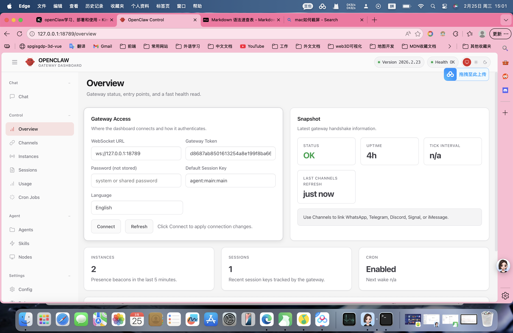
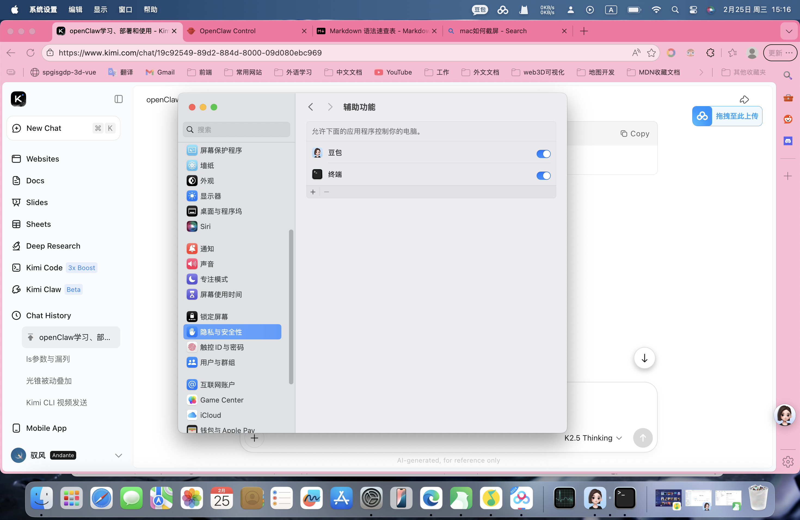

# OpenClaw macOS 完整部署手册

> 基于 OpenClaw 2026.2.23 (b817600) 版本验证
>
> 适用于 macOS + Node.js ≥ v22 环境  
>
> 最后更新：2026-02-25

---

## 目录
1. [前置要求](#前置要求)
2. [安装 OpenClaw](#安装-openclaw)
3. [模型配置详解](#模型配置详解)
4. [多模型配置示例](#多模型配置示例)
5. [部署问题排查](#部署问题排查)
6. [macOS 权限配置](#macos-权限配置)
7. [验证与测试](#验证与测试)

---

## 前置要求

### 1. 系统环境
- **操作系统**：macOS 12.0 (Monterey) 或更高版本
- **Node.js**：≥ v22（必须，低版本会导致未知错误）
- **npm**：≥ 10.x
- **Git**：用于可选的源码构建

### 2. 验证环境
```bash
node -v  # 应显示 v22.x.x
npm -v   # 应显示 10.x.x

# 如版本过低，使用 Homebrew 升级
brew update && brew upgrade node
```

## 安装OpenClaw

### 方案 A：npm 全局安装（推荐）
```bash
# 安装
npm install -g openclaw@latest

# 验证版本
openclaw --version
# 预期输出：2026.2.23 或更高版本
```

### 方案 B：源码构建（开发者可选）
```bash
git clone https://github.com/openclaw/openclaw.git
cd openclaw
npm install -g pnpm
pnpm install
pnpm ui:build && pnpm build
npm link
```

## 模型配置详解

### 1.创建配置目录
```bash
mkdir -p ~/.openclaw/workspace
chmod 700 ~/.openclaw
```

### 2.配置文件结构说明
配置文件位于 `~/.openclaw/openclaw.json`，核心字段：
| 字段 | 是否必填 | 说明 |
| ---- | ---- | ---- |
| `providers` | 是 | AI 服务商配置（API Key、BaseURL）|
| `models` | 是 | 模型参数（上下文长度、推理能力等）|
| `agents.defaults` | 是 | Agent 默认行为（并发数、工作目录）|
| `gateway` | 是 | 网关设置（端口、认证模式）|

<mark>
OpenClaw 配置 Schema 严格, 注意不要使用OpenClaw文档推荐以外的其他配置, 诸如：
</mark>

- ~~supportsThinking~~
- ~~temperature~~（需在调用时设置）
- ~~enableSwarm~~
- ~~showThinkingTrace~~
- ~~agents.defaults.tools~~

## 多模型配置示例

### 配置 1：Moonshot Kimi K2.5（国内推荐）
```json
{
  "meta": {
    "lastTouchedVersion": "2026.2.6-3",
    "lastTouchedAt": "2026-02-25T00:00:00.000Z"
  },
  "models": {
    "mode": "merge",
    "providers": {
      "moonshot": {
        "baseUrl": "https://api.moonshot.cn/v1",
        "apiKey": "sk-你的MoonshotAPIKey",
        "api": "openai-completions",
        "models": [
          {
            "id": "kimi-k2.5",
            "name": "Kimi K2.5 Thinking",
            "input": ["text", "image"],
            "contextWindow": 256000,
            "maxTokens": 8192,
            "reasoning": true
          }
        ]
      }
    }
  },
  "agents": {
    "defaults": {
      "workspace": "/Users/$(whoami)/.openclaw/workspace",
      "maxConcurrent": 4,
      "subagents": {
        "maxConcurrent": 8
      },
      "model": {
        "primary": "moonshot/kimi-k2.5"
      }
    }
  },
  "gateway": {
    "port": 18789,
    "mode": "local",
    "auth": {
      "mode": "token",
      "token": "使用openssl rand -hex 32生成"
    }
  }
}
```

### 配置 2：DeepSeek V3/R1（高性价比）
```json
{
  "models": {
    "mode": "merge",
    "providers": {
      "deepseek": {
        "baseUrl": "https://api.deepseek.com/v1",
        "apiKey": "sk-你的DeepSeekKey",
        "api": "openai-completions",
        "models": [
          {
            "id": "deepseek-chat",
            "name": "DeepSeek V3",
            "input": ["text"],
            "contextWindow": 64000,
            "maxTokens": 8192,
            "reasoning": false
          },
          {
            "id": "deepseek-reasoner",
            "name": "DeepSeek R1",
            "input": ["text"],
            "contextWindow": 64000,
            "maxTokens": 8192,
            "reasoning": true
          }
        ]
      }
    }
  },
  "agents": {
    "defaults": {
      "workspace": "/Users/$(whoami)/.openclaw/workspace",
      "maxConcurrent": 4,
      "model": {
        "primary": "deepseek/deepseek-reasoner"
      }
    }
  },
  "gateway": {
    "port": 18789,
    "mode": "local",
    "auth": {
      "mode": "none"
    }
  }
}
```

### 配置 3：OpenAI GPT-4o/o3-mini
```json
{
  "models": {
    "mode": "merge",
    "providers": {
      "openai": {
        "baseUrl": "https://api.openai.com/v1",
        "apiKey": "sk-你的OpenAIKey",
        "api": "openai-completions",
        "models": [
          {
            "id": "gpt-4o",
            "name": "GPT-4o",
            "input": ["text", "image"],
            "contextWindow": 128000,
            "maxTokens": 4096,
            "reasoning": false
          },
          {
            "id": "o3-mini",
            "name": "o3-mini",
            "input": ["text"],
            "contextWindow": 200000,
            "maxTokens": 100000,
            "reasoning": true
          }
        ]
      }
    }
  },
  "agents": {
    "defaults": {
      "workspace": "/Users/$(whoami)/.openclaw/workspace",
      "maxConcurrent": 4,
      "model": {
        "primary": "openai/gpt-4o"
      }
    }
  },
  "gateway": {
    "port": 18789,
    "mode": "local",
    "auth": {
      "mode": "token",
      "token": "your-token-here"
    }
  }
}
```

## 部署问题排查

### 问题 1：配置文件包含非法字段
**现象：**
```
Invalid config: Unrecognized keys: "supportsThinking", "temperature"
```
**原因：** OpenClaw 配置 Schema 严格，不支持自定义字段
**解决：**
- 删除 supportsThinking、temperature、enableSwarm、showThinkingTrace、tools 等字段
- 使用本文档提供的 **最小化配置模板**

### 问题 2：Token 认证失败
**现象：**
打开webui后，页面标红，chat按钮无法点击，页面上方提示“unauthorized: gateway token missing”
**原因：** 未在webui setting中填写配置文件中的token
**解决：**
1. 查看配置文件中的 token：
```bash
cat ~/.openclaw/openclaw.json | grep token
```
2. 在 Web UI 设置中粘贴 token

3. 或在开发环境改为 "mode": "none" 禁用认证（不推荐生产环境）

### 问题 3：模型 API 返回 429（限流）
**现象：**
对话频繁中断，日志显示 `429 Too Many Requests`
**原因：** 未在webui setting中填写配置文件中的token
**解决：**
- **Kimi：** 提升 Moonshot 账号等级至 Tier 2（充值 ≥ 200 元）
- **DeepSeek：** 降低 `maxConcurrent` 至 2
- **OpenAI：** 检查账户额度是否充足

### 问题 4：Session 存储目录缺失
**现象：**
```
CRITICAL: Session store dir missing
```
**解决：**
```bash
mkdir -p ~/.openclaw/agents/main/sessions
# 或运行
openclaw doctor  # 自动修复
```

### 问题 5：Memory Search 警告
**现象：**
```
Memory search is enabled but no embedding provider configured
```
**解决（二选一）：**
```bash
# 方案 A：禁用记忆搜索
openclaw config set agents.defaults.memorySearch.enabled false

# 方案 B：配置 Embedding API（需 OpenAI/Gemini API Key）
export OPENAI_API_KEY="sk-xxx"
```

## macOS 权限配置
为确保 OpenClaw 能正常控制系统，需授权以下权限：

### 1. 禁用睡眠（确保 7×24 运行）
```bash
sudo pmset -a sleep 0 displaysleep 0 disksleep 0
```

### 辅助功能权限（关键）
OpenClaw 需要控制鼠标键盘模拟：
1. 打开 系统设置 → 隐私与安全性 → 辅助功能
2. 点击 + 添加应用
3. 选择 终端（Terminal.app 或 iTerm.app）
4. 确保开关为开启状态


### 3. 全盘访问权限（如需文件操作）
如需让 Agent 访问桌面、下载文件夹等：
1. 系统设置 → 隐私与安全性 → 完全磁盘访问权限
2. 添加终端应用

### 4. 网络权限（首次运行时）
若弹出网络连接请求，请点击允许。

## 验证与测试

### 1. 检查配置文件语法
```bash
openclaw doctor
# 应显示：Config valid，无 Error
```

### 2. 启动网关
```bash
# 前台运行（查看日志）
openclaw gateway start

# 或后台运行
openclaw gateway start --daemon

# 或使用 LaunchAgent（推荐）
launchctl load ~/Library/LaunchAgents/ai.openclaw.gateway.plist
```

### 3. 验证服务状态
```bash
openclaw status
# 预期：Gateway: running on ws://127.0.0.1:18789
```

### 4. Web UI 测试
1. 访问 `http://127.0.0.1:18789/`
2. 如需 Token，在设置中输入配置文件中的 token
3. 输入测试指令：
```
请确认你当前使用的模型版本，并展示一个复杂逻辑推理过程
```

### 5. 常用命令备忘
```bash
# 查看日志
tail -f ~/.openclaw/logs/gateway.log

# 重启网关
openclaw gateway restart

# 停止网关
openclaw gateway stop
# 或
launchctl stop ai.openclaw.gateway

# 更新 OpenClaw
npm update -g openclaw
```

## 附录

### API Key 获取地址
| 服务商 | 注册/获取地址 | 备注 |
| ---- | ---- | ---- |
| Moonshot (Kimi) | `https://platform.moonshot.cn` | 国产模型，kimi-k2-thinking性能很强，手机号验证，新用户有免费额度 |
| DeepSeek | `https://platform.deepseek.com` | 国产模型，性价比高，支持 Reasoning 模型 |
| OpenAI | `https://platform.openai.com` | 需海外支付方式，新模型性能很强，不反华 |
| Anthropic | `https://console.anthropic.com` | 编程一哥，模型性能超强，价格也很感人（ps：反华）|
| MiniMax | `https://platform.minimaxi.com` | 国产模型，支持多模态，性能很强 |
| Google | `https://aistudio.google.com` | 新模型能力中上，而且google对国内用户也很友好，不反华 |

### 安全建议
1. **配置文件权限：** 务必设置 `chmod 600 ~/.openclaw/openclaw.json`，防止 API Key 泄露
2. **Token 安全：** 生产环境使用 "mode": "token"，开发环境可酌情禁用
3. **网络安全：** 如需公网访问，务必启用 Token 并配合 HTTPS 反向代理
4. **API Key 安全：** 定期轮换 Key，避免硬编码在脚本中